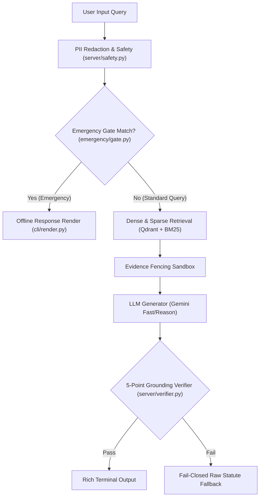

# Legal RAG Assistant (India)

A terminal-first, verifier-first Retrieval-Augmented Generation (RAG) assistant designed for Indian legal queries and statutory guidance.

This system provides grounded legal information across critical Indian statutes, including the Bharatiya Nagarik Suraksha Sanhita (BNSS), Negotiable Instruments Act (NI Act Section 138), Protection of Women from Domestic Violence Act (PWDVA 2005), and procedure for FIR refusal.

---

## Legal Disclaimer

This application provides general legal information for informational purposes only. It does not provide legal advice, representation, or formal legal opinions. In any emergency or legal dispute, consult a qualified advocate or contact national emergency helplines immediately. See `DISCLAIMER.md` for full terms.

---

## System Overview

Large Language Models (LLMs) used in legal RAG systems often suffer from hallucinated citations, incorrect section numbers, or fabricated statutory timelines. The Legal RAG Assistant solves this with a **deterministic, fail-closed verifier-first architecture**.

Every generated answer undergoes a 5-point grounding verification check. If the model output contains unverified quotes, incorrect section references, or unsupported timelines, the system automatically rejects the generated response and falls back to displaying raw, unedited statutory text.

Additionally, critical emergency queries (such as active police arrest or domestic violence) are intercepted by a zero-network, local matching gate to provide immediate rights and emergency helpline numbers without relying on external API availability.

---

## Primary Use Cases

1. **Emergency Arrest & Custody Rights Guidance**
   * Identifies immediate rights under BNSS Section 47, 48, 53, 58 and Article 22 of the Constitution of India.
   * Highlights rights regarding production before a magistrate within 24 hours, medical examination, and lawyer consultation.
   * Provides immediate emergency numbers (112, 15100 NALSA Free Legal Aid).

2. **Cheque Dishonour (NI Act Section 138)**
   * Computes statutory timelines for cheque dishonour notices (30-day notice window, 15-day payment period, 1-month cause of action).
   * Validates mandatory pre-requisites before filing a criminal complaint.

3. **FIR Refusal Procedures**
   * Outlines statutory remedies when a police station refuses to register an FIR under BNSS Section 173(4).
   * Details steps for submitting written complaints to the Superintendent of Police (SP) or filing a magistrate application.

4. **Domestic Violence Protection (PWDVA 2005)**
   * Outlines emergency remedies, protection officer access, residence rights, and interim monetary relief options.

5. **Old-to-New Statutory Crosswalk Mapping**
   * Maps legacy IPC, CrPC, and Indian Evidence Act provisions to their corresponding modern counterparts under Bharatiya Nyaya Sanhita (BNS), Bharatiya Nagarik Suraksha Sanhita (BNSS), and Bharatiya Sakshya Adhiniyam (BSA).

---

## System Architecture

The architecture is divided into five modular layers:



### Component Details

#### 1. Emergency Gate (`emergency/gate.py` & `emergency/emergency.yaml`)
* **Function**: Zero-network local keyword matcher operating entirely offline.
* **Mechanism**: Uses Unicode NFKC normalization, lowercasing, and lookaround boundary checks to match keywords in both English and Devanagari scripts.
* **Behavior**: Bypasses vector DB and LLM generation during emergency scenarios to eliminate latency and API dependency.

#### 2. Data Ingestion & Dual-Representation Chunking (`ingest/`)
* **`ingest/clean.py`**: Cleans formatting noise, orphan amendment brackets, and asterisks for vector embeddings without modifying raw statutory text.
* **`ingest/chunk.py`**: Creates dual-representation payloads containing:
  * `text`: Cleaned text used for dense vector and sparse keyword indexing.
  * `text_raw`: Verbatim statutory text preserved for strict verifier substring matching.

#### 3. Security, Privacy & Fencing (`server/safety.py`)
* **PII Redaction**: Strips Indian phone numbers, emails, PAN cards, and Aadhaar numbers prior to processing.
* **Prompt Fencing**: Wraps retrieved evidence chunks in sandboxed delimiters (`=== EVIDENCE CHUNK ===`) to prevent prompt injection attacks.

#### 4. Grounding Verifier (`server/verifier.py`)
A fail-closed verification engine enforcing 5 distinct warrants before outputting any answer:
1. **Existence Warrant**: Cited chunk IDs must exist in the retrieved evidence set.
2. **Verbatim Quote Warrant**: Every quote must be an exact substring match of `text_raw`.
3. **Identity Warrant**: The citation reference (`ref`) must match the chunk's canonical identifier.
4. **Substantive Warrant**: Quotes must meet minimum length thresholds and cannot originate from repealed or superseded provisions.
5. **Numerical Figure Warrant**: Days, hours, months, or year figures mentioned in generated text must be explicitly supported by cited text or computed statutory timelines.

If any check fails, `build_abstain_response()` returns verbatim statutory text instead of unverified model summaries.

#### 5. User Interface & Renderer (`cli/render.py`)
* Built using `rich` console components.
* Ensures dynamic text from LLM outputs or legal statutes is treated as plain text, preventing console markup injection vulnerabilities.

---

## Directory Structure

```
Legal-Rag-based-Assistant/
├── cli/
│   ├── __init__.py
│   └── render.py              # Rich terminal formatting & panel rendering
├── emergency/
│   ├── __init__.py
│   ├── emergency.yaml         # Offline emergency categories & helpline configuration
│   └── gate.py                # Zero-network offline keyword matcher
├── ingest/
│   ├── __init__.py
│   ├── clean.py               # Text cleaning for embedding generation
│   └── chunk.py               # Dual-representation chunk payload builder
├── schemas/
│   ├── __init__.py
│   ├── case_types/            # Structured case type definitions
│   │   ├── arrest_rights.yaml
│   │   ├── cheque_dishonour.yaml
│   │   ├── domestic_violence.yaml
│   │   └── fir_refusal.yaml
│   └── crosswalk/
│       └── old_to_new.yaml    # Legacy CrPC/IPC to BNSS/BNS crosswalk map
├── server/
│   ├── __init__.py
│   ├── config.py              # Pydantic environment configuration
│   ├── models.py              # API request and response data models
│   ├── safety.py              # PII redaction and evidence fencing
│   └── verifier.py            # Grounding verifier and fail-closed fallback
├── tests/
│   ├── test_emergency.py      # Emergency gate test suite
│   ├── test_safety_clean_chunk.py
│   ├── test_schemas_render.py
│   └── test_verifier.py       # Grounding verifier test suite
├── .env.example               # Environment variable template
├── DISCLAIMER.md              # Formal legal disclaimer
├── pyproject.toml             # Package setup and dependencies
├── README.md                  # Project documentation
└── run_demo.py                # Executable demonstration script
```

---

## Installation & Setup

### Prerequisites
* Python 3.12 or higher (Python 3.14 supported)
* `pip` package manager

### Steps

1. **Clone the repository and enter the directory**:
   ```bash
   cd Legal-Rag-based-Assistant
   ```

2. **Set up Environment Variables**:
   Copy the example environment configuration:
   ```bash
   cp .env.example .env
   ```
   Edit `.env` to supply API keys if performing online retrieval or generation:
   * `GEMINI_API_KEY`: Google Gemini API key
   * `QDRANT_URL` & `QDRANT_API_KEY`: Qdrant vector database credentials
   * `CLOUDFLARE_ACCOUNT_ID` & `CLOUDFLARE_API_TOKEN`: Cloudflare Workers AI embeddings credentials

3. **Install Dependencies**:
   Install the package in development mode:
   ```bash
   pip install -e .[dev]
   ```

---

## Running the Project

### 1. Run Unit Tests
Execute the test suite to verify module correctness:
```bash
pytest
```

### 2. Run the Interactive Demo
Launch the demonstration script to inspect all system layers in action:
```bash
python run_demo.py
```

### 3. Python Integration Example
You can import and execute individual components directly:

```python
from emergency.gate import EmergencyGate
from cli.render import emergency_hit_to_response, render_response

# Instantiate offline emergency gate
gate = EmergencyGate()

# Evaluate query
query = "My brother was arrested by police"
hit = gate.evaluate(query)

if hit:
    response = emergency_hit_to_response(hit, disclaimer="General legal info only.")
    render_response(response)
```

---

## Technology Stack

* **Language**: Python >= 3.12
* **CLI Rendering**: Rich
* **Data Validation**: Pydantic v2, PyYAML
* **Vector Store**: Qdrant Client (FastEmbed)
* **LLM Engine**: Google GenAI SDK (Gemini 3.5 Flash / Gemini 3.8 Flash)
* **Embedding Model**: Cloudflare Workers AI (`bge-m3`)
* **Testing Framework**: Pytest
